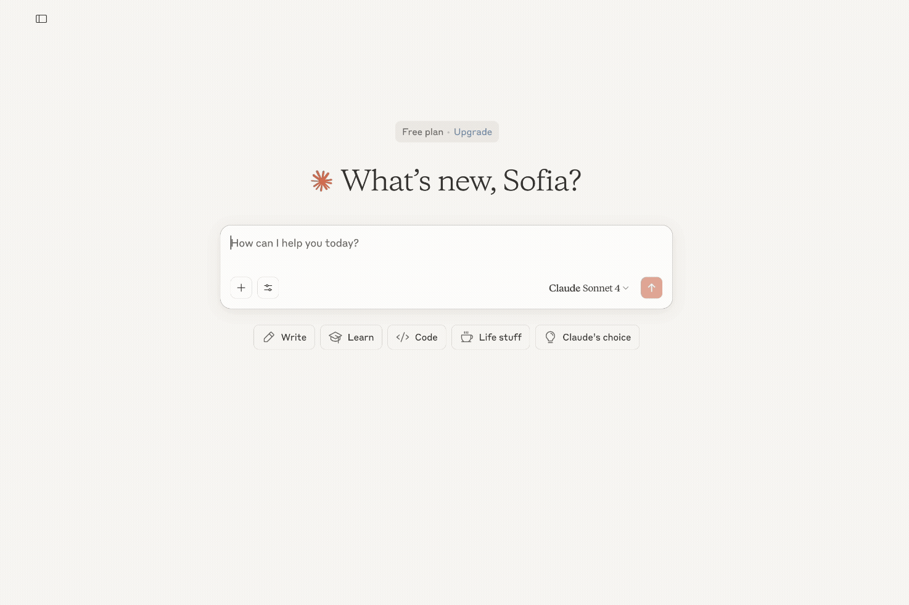

# Protein Structure Server

An MCP (Model Context Protocol) server that retrieves protein information by searching UniProt for accession numbers based on human protein names, then leverages AlphaFold to provide detailed protein data and direct links to AlphaFold structural predictions.

## Features

- 🔍 **Search proteins by name** - Find proteins with prioritization of human proteins
- 🧬 **Get detailed protein structure information** - Retrieve comprehensive protein data from UniProt and AlphaFold
- 📊 **Get UniProt accession numbers** - Convert protein names to UniProt IDs
- 🌐 **AlphaFold integration** - Direct links to 3D protein structure predictions

## Installation

### Prerequisites
- Python 3.13 or higher
- [uv](https://docs.astral.sh/uv/) package manager
- [Node.js](https://nodejs.org/) 

### Setup

1. Clone the repository:
```bash
git clone https://github.com/soffelcopter/protein_structure_MCP_server.git
cd protein_structure
```

2. Install dependencies:
```bash
uv sync
```

## Usage

### Connecting to Claude Desktop

To use this server with Claude Desktop, you need to configure it in your Claude Desktop settings:

1. Open Claude Desktop and go to **Settings** > **Developer** > **Edit Config**

2. Add the protein structure server to your configuration:

```json
{
  "mcpServers": {
    "protein_structure": {
      "command": "uv",
      "args": [
        "run",
        "--directory",
        "/absolute/path/to/your/protein_structure",
        "python",
        "protein_structure_server.py"
      ]
    }
  }
}
```

**Important:** Replace `/absolute/path/to/your/protein_structure` with the actual absolute path to your project directory.

3. Restart Claude Desktop completely

4. Once connected, you can ask Claude to search for proteins, get structure information, and more! This can look like this:



### Testing with Model Inspector

For testing and debugging your server independently, use the MCP Inspector:

```bash
# Navigate to your server directory
cd protein_structure

# Start the model inspector
npx @modelcontextprotocol/inspector uv run python protein_structure_server.py
```

The Model Inspector provides a web-based interface to test your MCP server tools directly, helping you understand whether your tools are working as expected before integrating with Claude Desktop.


### Available Tools

#### 1. `search_proteins(protein_name: str)`
Search for proteins by name, with human proteins prioritized.

**Example:**
```python
# Search for insulin proteins
search_proteins("insulin")
```

#### 2. `get_protein_structure(uniprot_accession: str)`
Get detailed information about a protein including structure data from AlphaFold.

**Example:**
```python
# Get insulin structure information
get_protein_structure("P01308")
```

#### 3. `get_uniprot_id(protein: str)`
Get the UniProt accession number for a protein name.

**Example:**
```python
# Get UniProt ID for insulin
get_uniprot_id("insulin")
```

## API Integration

This server integrates with:
- **UniProt REST API** - For protein metadata and sequence information
- **AlphaFold Database API** - For protein structure predictions and PDB file links

## Acknowledgments

- [UniProt](https://www.uniprot.org/) for protein sequence and annotation data
- [AlphaFold Database](https://alphafold.ebi.ac.uk/) for protein structure predictions
- [MCP](https://github.com/modelcontextprotocol/python-sdk) for the protocol implementation 